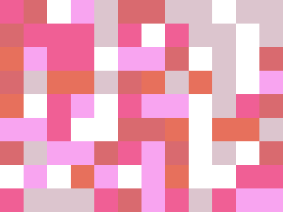

# no noob color

A persona-aware color palette tool for working creatives. Extract from photos,
generate from prompts, organize and share — all backed by industry-grade color
science (CIELAB, OKLab, ACES, Material 3 HCT, CIEDE2000) and a clean
B&W minimalist UI.



## Quick links

- **App** — Generate · Library · Blog · Profile (run locally, see below)
- **API docs** — `/docs` (Swagger UI)
- **PocketBase admin** — `/_/`

---

## What it does

### Generate
- **10 personas**, each with their own dedicated panel:
  - **UI / Web Designer** — WCAG audit matrix, hover/active states,
    60-30-10 visualizer, semantic tokens, light/dark theme pair, shadcn config
  - **Illustrator & Artist** — tints/shades/tones, Fitzpatrick skin tones,
    media simulator (gouache/watercolor/oil/ink), brush slot mapping
  - **Concept Artist** — color script timeline, lighting sim, subsurface
    scattering preview, time-of-day cycle
  - **Cinematographer** — film looks (orange/teal, Wes Anderson, Fincher,
    bleach bypass, Matrix, Gilmore), skin protect, day-for-night, .cube LUT
    download, ACES transforms
  - **Brand Designer** — color psychology, brand lock kit, gamut audit,
    RGB/CMYK matched pair, trademark proximity check, seasonal variations
  - **Print Designer** — CMYK gamut warning, ICC profile (FOGRA39, GRACoL,
    SWOP, Japan Color), ink density meter, spot color flag, bleed/safe area,
    finish simulator (gold/silver foil, holographic, UV, matte/gloss)
  - **Material 3** — Google HCT theme: 13-stop tonal palettes × 6 roles,
    27 semantic role tokens, surface elevation, light/dark scheme preview,
    CSS variables export
  - **Fashion** — Pantone Color of the Year reference, seasonal palettes,
    style presets (couture, streetwear, normcore, denim, monochrome, Y2K),
    dye lot variation
  - **Content Creator** — IG 9-grid feed preview, TikTok aesthetic match
    (coquette/Y2K/clean girl/grunge/cottagecore/dark academia/vaporwave),
    YouTube thumbnail CTR scoring, story templates
- **Prompt parsing** — TR + EN multi-word keyword bias (~150 entries
  covering temperature, mood, scene, hue family, aesthetic genre)
- **Reference image** — drop a photo, palette derived from k-means; auto-
  preprocesses to max 1200px before upload
- **AI bridge** — `/llm/prompt-to-palette` endpoint via OpenAI or Apify
  (env-gated, optional)
- **Daily taste training** — different swatch set every day, builds a
  bias histogram; liked colors saved to a separate library tab
- **Color blindness preview** — Brettel/Viénot matrices for protan,
  deuteran, tritan applied live to the strip

### Library
- Two tabs: **Palettes** + **Liked colors**
- Search by hex / source / date prefix
- Folders, tags, star/favorite, JSON bulk export-import
- **Diff mode** — pick two palettes, side-by-side compare with avg
  color distance
- **Share** — `/#/share/<slug>` URL with palette encoded; lands on a
  ProfilePill + ExportMenu page anyone can use
- **Realtime sync** — PocketBase SSE subscription; cross-device adds
  appear without refresh

### Blog
- 8 in-depth articles + live demos (RGB→Lab, WCAG contrast, HSV picker,
  sRGB→CMYK gamut)
- Topics: foundations, RGB/CMYK/HEX, HSL/HSV, CIELAB, WCAG, Material 3,
  ACES + OpenColorIO, 10 years of colour-science

### Auth
- Email + password (PocketBase users collection)
- Email verification + password reset flows
- Profile page: account info, library stats, sign out

### Export formats
Procreate `.swatches` · Adobe `.ase` · Tailwind config · CSS variables ·
shadcn/ui · JSON · SVG poster · plain text · `.cube` LUT (33³ default)

---

## Stack

| Layer | What |
|---|---|
| Frontend | Vue 3 (`<script setup>`) · Vite 6 · TypeScript · Pinia · Vue Router 4 · marked · vite-plugin-pwa · Tippy |
| Backend | Python 3.12 · FastAPI · uvicorn · numpy · scikit-learn · scikit-image · Pillow |
| Color science | colour-science · material-color-utilities-python · glasbey |
| BaaS | PocketBase (SQLite, auth, file storage, realtime SSE) |
| Optional | OpenAI / Apify (LLM palette gen) |

The Python service is the single source of color truth. The frontend
falls back to local k-means + HSV harmonies when the API is offline,
so palette extraction works without any backend running.

---

## Run locally

Three processes. Open three terminals.

### 1. PocketBase (BaaS)

Download once into `pocketbase/`:

```sh
cd pocketbase
curl -L -o pb.zip "https://github.com/pocketbase/pocketbase/releases/download/v0.37.4/pocketbase_0.37.4_darwin_arm64.zip"
unzip -o pb.zip pocketbase && rm pb.zip
chmod +x pocketbase
./pocketbase superuser upsert admin@example.com yourpassword
./pocketbase serve
```

The `palettes` collection is created automatically on first boot from
`pocketbase/pb_migrations/`.

### 2. Python API

```sh
cd api
python3 -m venv .venv && source .venv/bin/activate
pip install -r requirements.txt
cp .env.example .env  # adjust if PB is not on default port
uvicorn main:app --reload --port 8000
```

### 3. Web (Vite)

```sh
cd web
npm install
npm run dev
```

Open <http://localhost:5173>. Sign in or use anonymously (everything
works without auth, library lives in localStorage).

### Or use docker-compose

For a one-shot built bundle (no hot reload):

```sh
cd web && npm run build && cd ..
docker compose up --build
```

Open <http://localhost:8080>.

---

## API endpoints

```
GET  /                        endpoint listing
POST /extract/kmeans          image → N k-means swatches in Lab/RGB/OKLab
POST /extract/colorthief      image → median-cut palette
POST /extract/segment         SLIC superpixel + weighted k-means
POST /extract/skin-aware      extract excluding/keeping/annotating skin
POST /harmonize               base color + rule → palette
POST /contrast/wcag           pair contrast ratio + AA/AAA grade
POST /contrast/audit          NxN palette contrast matrix
POST /contrast/delta-e        CIE76 / CIE94 / CIEDE2000 difference
POST /contrast/delta-e/matrix pairwise palette delta-E
POST /convert/spaces          RGB / Lab / OKLab / CMYK / HSL conversions
POST /colorblind/simulate     Brettel/Viénot CVD per palette
POST /tones/generate          single seed → 11-stop tonal scale (OKLCH)
POST /tones/tailwind          + Tailwind config snippet
POST /material/theme          Material 3 — roles + tonal palettes + light/dark
POST /material/css-variables  Material 3 as CSS custom properties
POST /llm/prompt-to-palette   freeform prompt → palette (OpenAI/Apify)
GET  /llm/status              configured providers
POST /glasbey/generate        max-distinct N colors via Glasbey
POST /lut/cube                .cube 3D LUT download
POST /aces/convert            sRGB / Rec.709 / Rec.2020 / P3 / ACEScg / ACES2065-1
POST /pantone/match           closest Pantone-like CIEDE2000 match

Auth:
POST /auth/signup             create user + auto-login
POST /auth/login              email + password
GET  /auth/me                 current user from bearer token
GET  /auth/health             PocketBase reachability
POST /auth/verify/request     send verification email
POST /auth/password/request-reset / confirm-reset

Palettes (require bearer token):
GET  /palettes                list user's palettes
POST /palettes                save (JSON)
POST /palettes/with-thumbnail save with image (multipart)
GET  /palettes/{id}           fetch one
PATCH /palettes/{id}          rename / change source
DELETE /palettes/{id}         remove
```

Full docs at `/docs` (Swagger UI).

---

## Project layout

```
no noob color/
├── api/                      Python FastAPI service
│   ├── routers/              one file per endpoint group
│   ├── services/             color_science, pocketbase client, auth_dep
│   ├── data/                 Pantone-like reference subset
│   └── requirements.txt
├── web/                      Vue 3 + Vite + TS
│   └── src/
│       ├── components/persona/  10 persona-specific panels
│       ├── components/blog/     4 live demo components
│       ├── views/               Generate, Library, Blog, Profile, Share, ...
│       ├── stores/              auth, library, persona, taste, theme, profile, toast
│       ├── services/            api, color, colorblind, promptBias, realtime, etc.
│       ├── composables/         useRefImage
│       └── data/blog/           8 articles (markdown sections + demo refs)
├── pocketbase/
│   └── pb_migrations/        palettes collection schema
├── prototype/                Original single-file HTML prototype
├── docs/                     Demo gif and screenshots
├── docker-compose.yml        PocketBase + API + nginx (built web)
└── .github/workflows/ci.yml  Typecheck + build on PR/push
```

---

## Roadmap

- Mobile via Capacitor (iOS + Android)
- Figma plugin for one-click variable injection
- Glossary + interactive playground at `/playground`
- Per-palette versioning with parent_id
- More personas: print finishing, accessibility specialist, tattoo artist
- Web Worker offload for k-means; Rust + WASM port

---

## License & credits

Source on [GitHub](https://github.com/ilknurbudak/no-noob-color).
Full credits and library list on the in-app `/about` page.

Made by Ilknur Budak — a fine artist building tools for working creatives.
